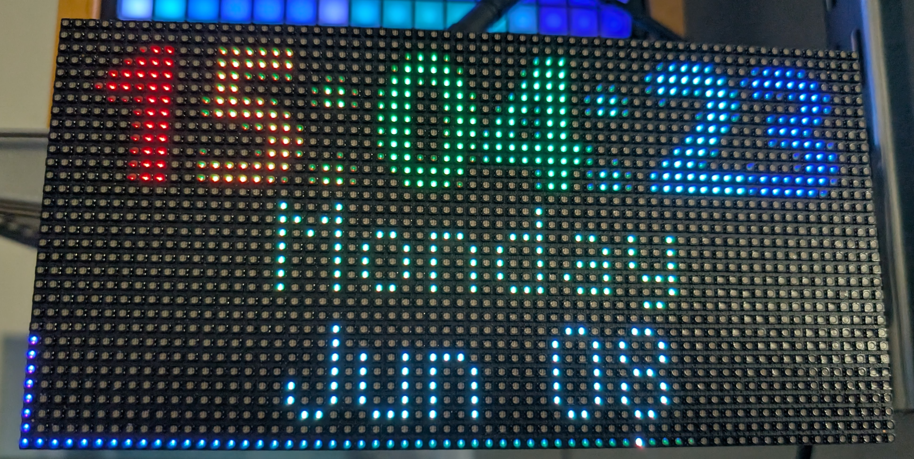

This is a "fancy" animated clock that syncs to NTP and presents the time, day of the week, and date in a colorful way.  I used a 64x32 pixel display but you should be able to adapt it to your 

wifi ssid, wifi password and webrepl password go into the secrets file (example provided).

While this may work on the latest firmware for the I75W board, I provided the script I used at the time to compile an updated firmware as well as the firmware file itself.  Flash this just like any other firmware for the RP2350.
